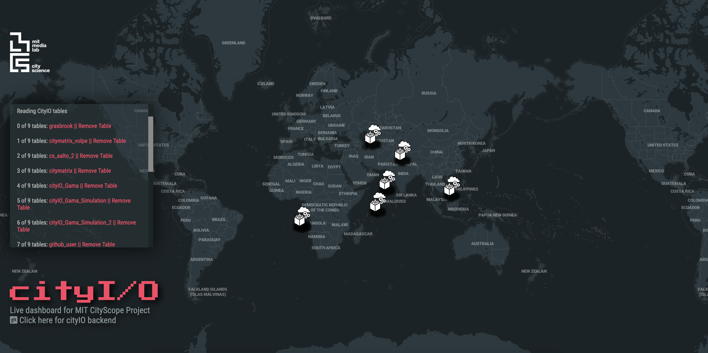

# cityIO API Frontend

### Dashboard for MIT CityScope Worldwide Deployments

This repo provides the code for a front-end interface of the cityIO backend server. This code can be used to display an overview of current active CityScope deployments around the world and show a real-time dashboard of the cityIO API Data Visualization for each table.

### Dependencies for test, develop and push to git

- from a dev environment: an up to date environnement: Debian Buster, Ubuntu 18.10
- get git (optionnal if you won't commit to this repo)
- Get [nodejs] (probably adding the latest node repo for your distrib to your apt sources.list)
- Get [parcelJS](https://parceljs.org/) (`npm install -g parcel-bundler`)
- Clone repo (using git or downloading it above)
- run using `parcel index.html`
- edit at will and PR

### dependencies for prod env

a stable tested environnement atm: debian Stretch, Ubuntu 18.04

- get git (optionnal if you won't commit to this repo)
- Get [nodejs] (probably from the apt repo)
- Get [parcelJS](https://parceljs.org/) (`npm install -g parcel-bundler`)
- Clone repo (using git or downloading it above)
- run using `parcel index.html`, this should `npm install .` if you haven't done it already.

---

Maintained by [Ariel Noyman](http://arielnoyman.com)

[Repo Contributors](https://github.com/CityScope/CS_CityIO_Frontend/graphs/contributors)
